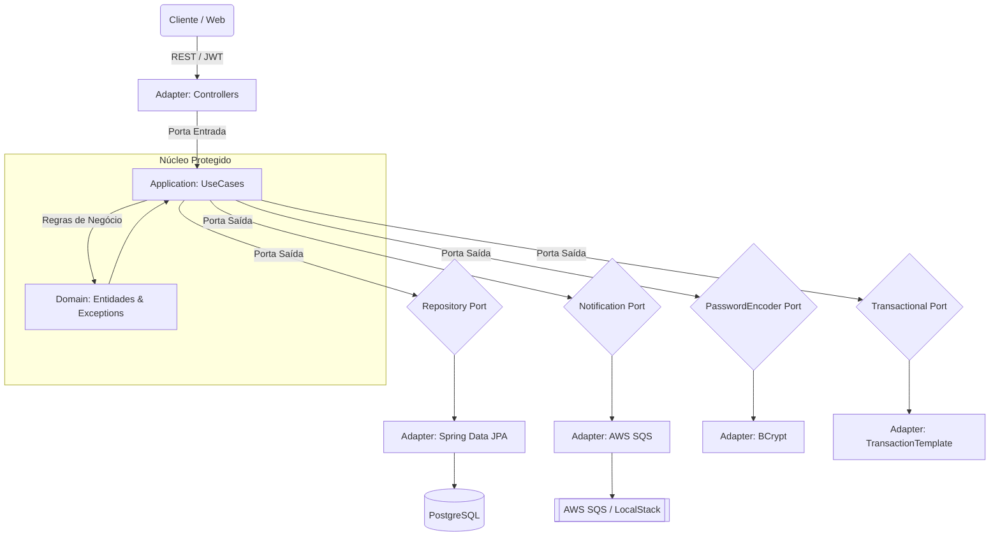

# 🐺 Vivaldi Bank API


> *"O código é como uma espada de prata: precisa ser afiado, leve e mortal contra bugs."*

API financeira Enterprise construída com **Arquitetura Hexagonal**, preparada para rodar localmente via **LocalStack** ou na **AWS Cloud**.

---

## 🏰 Arquitetura



### Decisões Arquiteturais

- **`TransactionalPort`** — transações gerenciadas via porta, mantendo UseCases livres do Spring. Usa `TransactionTemplate` em vez de `@Transactional` (AOP), evitando problemas de self-invocation.
- **`SecurityFilter`** — depende de `UserDetailsService`, não do repositório diretamente.
- **ArchUnit** — testes arquiteturais validam as fronteiras em tempo de build.

---

## ⚔️ Tech Stack

| Categoria | Tecnologia |
|---|---|
| **Linguagem** | Java 21 (LTS) |
| **Framework** | Spring Boot 3.5 |
| **Segurança** | Spring Security + JWT (auth0 java-jwt) |
| **Persistência** | Spring Data JPA + PostgreSQL + Flyway |
| **Mensageria** | AWS SQS (awspring) |
| **Observabilidade** | Prometheus + Grafana |
| **Testes** | JUnit 5, Mockito, JaCoCo, ArchUnit, Testcontainers |
| **Documentação** | SpringDoc OpenAPI (Swagger UI) |
| **Infraestrutura** | Docker, Terraform, AWS ECR |
| **CI/CD** | GitHub Actions + Amazon ECR |
| **Qualidade** | Qodana (JetBrains) |

---

## 🎒 Pré-requisitos

1. **Java 21 JDK**
2. **Docker Desktop** (necessário para testes de integração via Testcontainers)
3. **AWS CLI** configurado (`aws configure`)
4. **Terraform**
5. **GitHub CLI** — `gh` (opcional)

---

## 🧪 Rodando Localmente (DEV)

### 1. Variáveis de Ambiente

```bash
cp env.example .env
# Edite .env com os valores de desenvolvimento
```

### 2. Subir Infraestrutura Local

```bash
docker compose --env-file .env up -d
```

| Serviço | Porta |
|---|---|
| PostgreSQL | 5432 |
| LocalStack (SQS) | 4566 |
| Prometheus | 9090 |
| Grafana | 3000 (admin/admin) |

### 3. Executar a Aplicação

```bash
./gradlew bootRun --args='--spring.profiles.active=dev'
```

Via IntelliJ: use `.run/Vivaldi - DEV.run.xml`.

### 4. Swagger UI

```
http://localhost:8080/swagger-ui/index.html
```

---

## 🧬 Testes

### Unitários (sem Docker)

```bash
./gradlew test --tests "com.vivaldibank.application.*"
./gradlew test --tests "com.vivaldibank.domain.*"
./gradlew test --tests "com.vivaldibank.infrastructure.adapters.in.web.*"
```

### Todos os testes + cobertura JaCoCo

Requer **Docker rodando**:

```bash
./gradlew test jacocoTestReport
```

Relatório: `build/reports/jacoco/test/html/index.html`

### Testes de Arquitetura (ArchUnit)

```bash
./gradlew test --tests "com.vivaldibank.ArchitectureTest"
```

**Fronteiras verificadas:**
- `domain` não depende de `infrastructure` nem de `application`
- `application` não depende de `infrastructure` nem de frameworks (Spring, Jakarta)
- `adapters.in.web` não depende de `adapters.out.persistence`

---

## 📜 Endpoints

| Método | Rota | Descrição | Acesso |
|---|---|---|---|
| `POST` | `/auth/login` | Autenticação — retorna JWT | 🔓 Público |
| `POST` | `/contas` | Abertura de conta (auto-login) | 🔓 Público |
| `GET` | `/contas/{id}` | Saldo e extrato | 🔒 JWT |
| `POST` | `/contas/{id}/deposito` | Depósito | 🔒 JWT |
| `POST` | `/contas/{id}/saque` | Saque | 🔒 JWT |
| `POST` | `/contas/{origem}/transferencia` | Transferência | 🔒 JWT |

---

## 🦅 Deploy Completo na AWS

Siga esta ordem — pular etapas causará erros.

### Etapa 1 — Provisionar Infraestrutura (Terraform)

```bash
cd terraform
cp terraform.tfvars.example terraform.tfvars
# terraform.tfvars contém: db_password = "admin123"

terraform init
terraform apply -auto-approve
```

O Terraform detecta seu IP automaticamente e libera apenas ele no Security Group do RDS.

Outputs ao final:

```
ecr_url     = "635106763014.dkr.ecr.us-east-1.amazonaws.com/vivaldi-bank-api"
db_endpoint = "vivaldi-db-instance.xxxxxx.us-east-1.rds.amazonaws.com:5432"
ip_liberado = "SEU_IP/32"
```

> Copie o `db_endpoint` — será usado no próximo passo.

### Etapa 2 — Configurar o Script de Deploy

```bash
cd ..
cp run_app.template.sh run_app.sh
```

> ⚠️ Windows/WSL — corrija quebras de linha antes de executar:
> ```bash
> sed -i 's/\r//' run_app.sh
> ```

Edite `run_app.sh`:

```bash
AWS_ACCOUNT_ID="<seu account id AWS>"
ENV_DB_HOST="<db_endpoint sem a porta>"
ENV_DB_PASSWORD="admin123"
```

### Etapa 3 — Enviar Imagem para o ECR

O CI/CD faz isso automaticamente a cada push na `main`. Para disparar manualmente:

```bash
gh workflow run ci-pipeline.yml --ref main
gh run watch
```

Aguarde o CI concluir antes de continuar.

Ou build e push manual:

```bash
aws ecr get-login-password --region us-east-1 | \
  docker login --username AWS --password-stdin \
  <AWS_ACCOUNT_ID>.dkr.ecr.us-east-1.amazonaws.com

./gradlew bootJar
docker build -t vivaldi-bank-api .
docker tag vivaldi-bank-api:latest \
  <AWS_ACCOUNT_ID>.dkr.ecr.us-east-1.amazonaws.com/vivaldi-bank-api:latest
docker push \
  <AWS_ACCOUNT_ID>.dkr.ecr.us-east-1.amazonaws.com/vivaldi-bank-api:latest
```

### Etapa 4 — Executar

```bash
./run_app.sh
```

### Etapa 5 — Validar

```bash
curl -X POST http://localhost:8080/contas \
  -H "Content-Type: application/json" \
  -d '{
    "nomeTitular": "Geralt de Rivia",
    "cpf": "093.311.626-85",
    "depositoInicial": 100.00,
    "senha": "senha123"
  }'
```

Resposta esperada: `HTTP 201` com `id`, `numeroConta` e `token`.

---

## 🗑️ Destruindo a Infraestrutura

> ⚠️ O RDS tem `deletion_protection = true`. Siga a ordem abaixo.

```bash
# 1. Desativa proteção via AWS CLI
aws rds modify-db-instance \
  --db-instance-identifier vivaldi-db-instance \
  --no-deletion-protection \
  --apply-immediately

# 2. Aguarda ~1 minuto e destroi tudo
cd terraform
terraform destroy -auto-approve
```

---

## ⚡ CI/CD — GitHub Actions

### Java CI (`ci-pipeline.yml`)

Push em `main`, `feat/**`, `refactor/**` e PRs para `main`.

1. Setup Java 21 + build + testes
2. Relatório JaCoCo (artefato na aba Summary)
3. Build e push da imagem para o ECR

**Secrets necessários:** `AWS_ACCESS_KEY_ID`, `AWS_SECRET_ACCESS_KEY`

### Qodana (`qodana_code_quality.yml`)

Análise estática de qualidade. **Secret necessário:** `QODANA_TOKEN`

---

## 👨‍💻 Autor

**Weriton L. Petreca**

- 💼 [LinkedIn](https://www.linkedin.com/in/weriton-petreca)
- 🌐 [weriton.dev](https://weriton.dev)
- 📧 eulcfr@gmail.com

---

*"Vá, mas não se esqueça de limpar os logs depois da batalha."* 🐎
