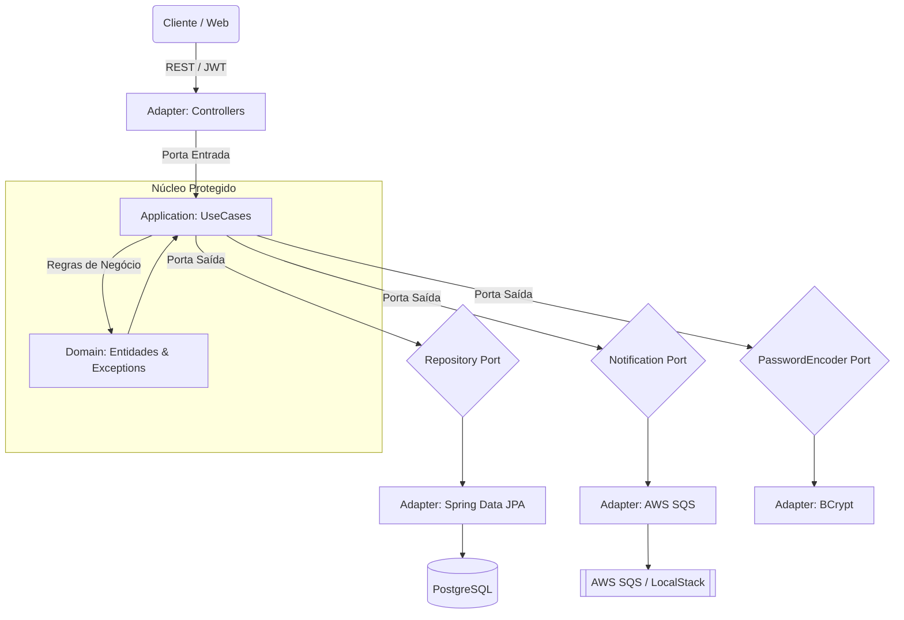

# 🐺 Vivaldi Bank API


> *"O código é como uma espada de prata: precisa ser afiado, leve e mortal contra bugs."*

Bem-vindo a **Kaer Morhen**, a fortaleza digital do **Vivaldi Bank**. Esta é uma API financeira Enterprise, forjada para suportar alta concorrência, escalabilidade e segurança bancária. O projeto segue estritamente as melhores práticas de Engenharia de Software, preparado para rodar tanto em simulações locais (**LocalStack**) quanto no campo de batalha real (**AWS Cloud**).

---

## 🏰 Arquitetura (O Diagrama da Fortaleza)

Este sistema foi construído sobre os pilares da **Arquitetura Hexagonal (Ports & Adapters)**. O Domínio (Regras de Negócio) é o coração protegido, isolado de frameworks e drivers externos.



---

## ⚔️ O Arsenal (Tech Stack)

Cada ferramenta foi escolhida com a precisão de um alquimista preparando uma poção:

*   **Java 21 (LTS):** A Lâmina Principal. Performance e tipagem forte.
*   **Spring Boot 3.5.9:** Os Mutagênicos. Framework base para injeção de dependência e web.
*   **Spring Security + JWT:** O Sinal Heliotrop. Proteção robusta contra acessos não autorizados.
*   **Docker & Docker Compose:** A Caixa de Dimeritium. Isolamento completo de ambientes.
*   **Terraform:** Magia da Terra (IaC). Provisionamento de infraestrutura real na AWS.
*   **LocalStack:** Ilusão de Nível Mestre. Simula SQS e S3 localmente.
*   **Flyway:** O Cronista. Versionamento e migração evolutiva do banco de dados.
*   **Prometheus & Grafana:** Sentidos de Bruxo. Observabilidade e métricas em tempo real.
*   **Qodana & ArchUnit:** O Medalhão. Análise estática de qualidade e testes de arquitetura.
*   **Testcontainers:** Bonecos de Treino. Testes de integração com banco real em container.

---

## 🎒 Inventário (Pré-requisitos)

Antes de iniciar a caçada, certifique-se de ter equipado:

1.  **Java 21 JDK**
2.  **Docker Desktop** (Engine rodando)
3.  **AWS CLI** (Configurado, mesmo que use credenciais dummy)
4.  **Terraform** (Opcional, apenas para deploy AWS)

---

## 🧪 Preparação das Poções (Setup)

### 1. Configure as Variáveis de Ambiente
O projeto inclui um grimório base em `env.example`.
*   Para rodar localmente, o Docker Compose já injeta as variáveis necessárias para o ambiente DEV.
*   Para configurações manuais, crie arquivos `.env.dev` ou `.env.prod` baseados no `env.example` na raiz do projeto.

### 2. O Caminho do Lobo (Ambiente de Desenvolvimento)
Rode a infraestrutura completa (Banco, LocalStack, Monitoramento) com um único comando:

```bash
docker compose up -d
```

Isso invocará:
*   **PostgreSQL 16** (Porta 5432)
*   **LocalStack** (Porta 4566 - SQS/S3)
*   **Prometheus** (Porta 9090)
*   **Grafana** (Porta 3000 - Login: `admin`/`admin`)

Execute a aplicação via Gradle ou IntelliJ (Profile: `dev`):
```bash
./gradlew bootRun --args='--spring.profiles.active=dev'
```

---

## 🦅 O Caminho do Grifo (Deploy & Scripts)

### Automação de Runtime (Witcher Ops)
Possuímos um script especializado para rodar a imagem de produção localmente, simulando o ambiente final.

1.  Copie o template: `cp run_app.template.sh run_app.sh`
2.  Edite o `run_app.sh` com suas credenciais (O git ignora este arquivo por segurança).
3.  Execute o ritual:
    ```bash
    ./run_app.sh
    ```

### Infraestrutura como Código (Terraform)
Para materializar a fortaleza na nuvem AWS:

```bash
cd terraform
terraform init
terraform apply -auto-approve
```
⚠️ *Lembre-se de destruir os recursos após o uso (`terraform destroy`) para evitar a maldição da Fatura AWS.*

---

## ⚡ CI/CD: O Teste das Ervas (GitHub Actions)

Toda vez que um código é empurrado para a `main` ou branchs de `feat/`, ele passa pelo rigoroso "Trial of the Grasses":

1.  **Checkout & Setup:** Prepara o ambiente Java 21.
2.  **Build & Unit Tests:** Compila e roda testes unitários.
3.  **Integration Tests:** Roda testes pesados usando Testcontainers (banco real volátil).
4.  **Architecture Tests:** O ArchUnit verifica se alguém violou as regras hexagonais.
5.  **Quality Gate:** O Qodana analisa o código em busca de bugs e vulnerabilidades.
6.  **Docker Build & Push:** Se tudo passar, a imagem é forjada e enviada ao Amazon ECR.

---

## 📜 Contratos (Endpoints Principais)

A documentação completa (Swagger UI) está disponível em:
👉 [http://localhost:8080/swagger-ui/index.html](http://localhost:8080/swagger-ui/index.html)

| Método | Rota | Descrição | Nível de Acesso |
| :--- | :--- | :--- | :---: |
| `POST` | `/auth/login` | Autenticação (Retorna JWT) | 🔓 Público |
| `POST` | `/contas` | Abertura de Conta | 🔓 Público |
| `GET` | `/contas/{id}` | Consulta de Saldo/Extrato | 🔒 Bearer Token |
| `POST` | `/contas/{id}/deposito` | Realizar Depósito | 🔒 Bearer Token |
| `POST` | `/contas/{id}/saque` | Realizar Saque | 🔒 Bearer Token |
| `POST` | `/contas/{origem}/transferencia` | Transferência entre contas | 🔒 Bearer Token |

---

## 👨‍💻 O Mestre Bruxo (Autor)

Forjado e mantido por **Weriton L. Petreca**

*   💼 [LinkedIn](https://www.linkedin.com/in/weriton-petreca)
*   📧 Contato: eulcfr@gmail.com

---

*"Vá, mas não se esqueça de limpar os logs depois da batalha."* 🐎
