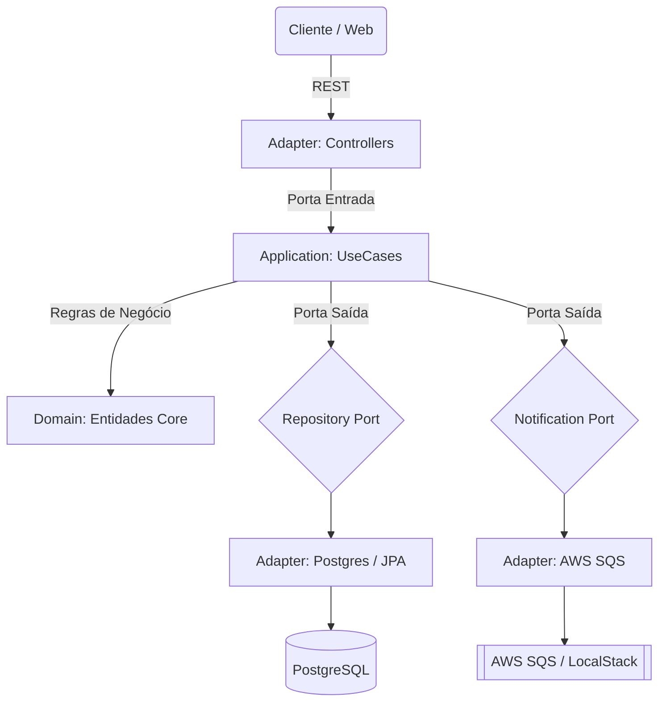

# 🐺 Vivaldi Bank API


> *"Os bancos Vivaldi garantem o seu ouro melhor do que as muralhas de Kaer Morhen. Inovação anã com segurança élfica."*

Bem-vindo ao repositório do núcleo digital do **Banco Vivaldi**. Este projeto é uma API financeira de alta performance, projetada para escalar desde as ruas de Novigrad até os confins de Nilfgaard.

---

## 🏰 Arquitetura (O Projeto da Fortaleza)

Este sistema foi forjado seguindo estritamente a **Arquitetura Hexagonal (Ports & Adapters)**. O objetivo é blindar as Regras de Negócio (Domínio) contra mudanças externas, garantindo longevidade e testabilidade.



### 🧩 Módulos do Sistema

*   **Domain (O Núcleo Puro):** Entidades como `Conta` e `Movimentacao`. Aqui vivem as regras matemáticas e validações (ex: Saldo Insuficiente, Validação de CPF). Sem dependência de frameworks.
*   **Application (Os Bruxos):** Casos de Uso que orquestram o fluxo (`CriarConta`, `RealizarTransferencia`). Eles coordenam as portas.
*   **Infrastructure (O Mundo Exterior):**
    *   **Web:** Controllers REST documentados com OpenAPI (Swagger).
    *   **Persistence:** PostgreSQL 16 com Flyway Migrations para versionamento de schema.
    *   **Messaging:** Integração assíncrona com AWS SQS para eventos de auditoria e notificações.
    *   **Security:** Implementação robusta com Spring Security e JWT Stateless.

---

## 📜 Funcionalidades (O Contrato)

O sistema oferece serviços financeiros completos, protegidos contra falhas e ataques:

### 💰 Gestão de Coroas (Core Banking)
*   **Abertura de Conta:** Criação imediata com hashing de senha (BCrypt) e emissão automática de Token de Acesso.
*   **Transacional:** Depósitos, Saques e Transferências entre contas com garantia de atomicidade (`@Transactional`) e lock otimista/pessimista.
*   **Consultas:** Busca de contas por ID (UUID) ou Número da Conta.

### 📨 Mensageria (The Megascope)
Comunicação desacoplada orientada a eventos (Event-Driven):
*   **CONTA_CRIADA:** Dispara processos de onboarding.
*   **LOGIN_REALIZADO:** Evento de segurança para auditoria e detecção de fraude.
*   **MOVIMENTACAO_REALIZADA:** Log assíncrono de todas as transações financeiras.

### 🛡️ Segurança (Sinal Quen)
*   **Autenticação Stateless:** Uso de JSON Web Tokens (JWT/HMAC256) para escalabilidade horizontal.
*   **Password Encoding:** Nenhuma senha é salva em texto plano. Usamos adaptadores de criptografia forte.
*   **Validação Defensiva:** Camada de validação de dados (Bean Validation) e tratamento global de erros (ProblemDetail - RFC 7807).

---

## 🧪 Estratégia de Qualidade (O Teste das Ervas)

A qualidade é garantida por uma Pirâmide de Testes rigorosa, validada em Pipeline CI/CD:

*   **Testes de Unidade (Domain & UseCases):** Validam a matemática financeira e regras de negócio isoladas. São rápidos e rodam a cada commit.
*   **Testes de Integração (@SpringBootTest):** Usam Testcontainers para subir um PostgreSQL real (nada de H2 em memória!) e validar a persistência e queries SQL.
*   **Testes de Componente (Web):** Validam os Controllers, serialização JSON e códigos HTTP.
*   **Testes de Arquitetura (ArchUnit):** Um "Guardião" automatizado que impede violações arquiteturais (ex: Domínio não pode depender do Spring).

---

## 🚀 Como Executar (Invocando o Portal)

**Pré-requisitos:** Docker e Java 21.

1.  **Clone o grimório:**
    ```bash
    git clone https://github.com/weritonpetreca/vivaldi-bank.git
    cd vivaldi-bank
    ```

2.  **Inicie a infraestrutura mágica (Docker Compose):**
    Este comando subirá o PostgreSQL, o LocalStack (simulando a AWS) e a API.
    ```bash
    docker compose up -d --build
    ```
    *Aguarde alguns segundos para o Healthcheck do LocalStack aprovar a conexão.*

3.  **Acesse a documentação (Swagger UI):**
    Acesse o grimório interativo em:
    👉 [http://localhost:8080/swagger-ui/index.html](http://localhost:8080/swagger-ui/index.html)

---

## 🛠️ Endpoints Principais

| Método | Rota | Descrição | Nível de Acesso |
| :--- | :--- | :--- | :---: |
| `POST` | `/auth/login` | Autentica usuário e retorna JWT | 🔓 Público |
| `POST` | `/contas` | Abre nova conta no banco | 🔓 Público |
| `POST` | `/contas/{id}/transferencia` | Transfere valores entre contas | 🔒 Seguro |
| `POST` | `/contas/{id}/saque` | Realiza saque (valida saldo) | 🔒 Seguro |
| `GET` | `/contas/{id}` | Consulta dados da conta | 🔒 Seguro |

---

## 👨‍💻 O Mestre Bruxo (Autor)

Desenvolvido por **Weriton L. Petreca**

*   💼 [LinkedIn](https://www.linkedin.com/in/weriton-petreca)
*   📧 Contato: eulcfr@gmail.com

---

*"Wind's howling... looks like rain."* ⛈️
