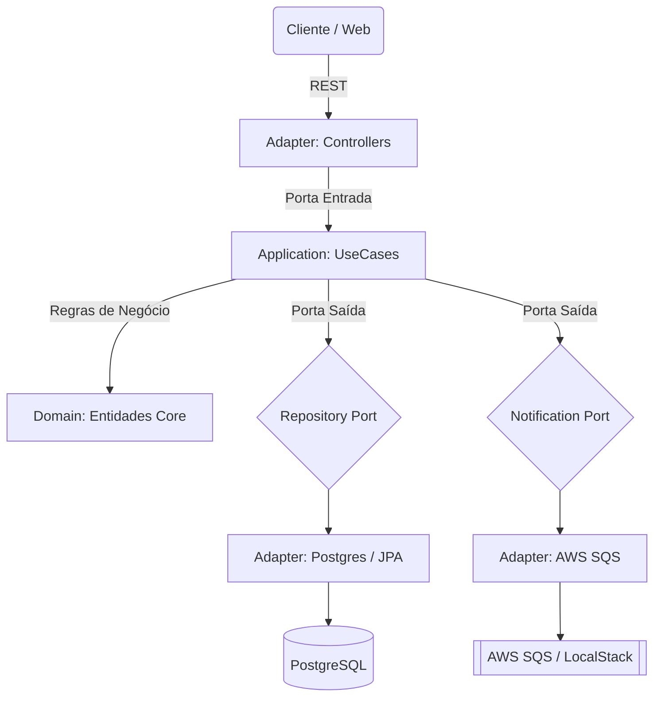

# 🐺 Vivaldi Bank API


> *"O código é como uma espada de prata: precisa ser afiado, leve e mortal contra bugs."*

Bem-vindo a **Kaer Morhen**, ou melhor, ao repositório do **Vivaldi Bank**. Este projeto é uma API financeira robusta, forjada para suportar alta concorrência e escalabilidade, preparada tanto para o ambiente simulado (**LocalStack**) quanto para o mundo real (**AWS Cloud**).

---

## 🏰 Arquitetura (O Projeto da Fortaleza)

Este sistema foi forjado seguindo estritamente a **Arquitetura Hexagonal (Ports & Adapters)**. O objetivo é blindar as Regras de Negócio (Domínio) contra mudanças externas, garantindo longevidade e testabilidade.



---

## ⚔️ O Bestiário Tecnológico (Tech Stack)

Cada ferramenta foi escolhida com a precisão de um alquimista:

*   **Java 21 (LTS):** A Espada de Prata. Moderna, rápida e tipada.
*   **Spring Boot 3.5:** Os Mutagênicos. Injeção de dependência e auto-configuração.
*   **Docker & Docker Compose:** A Caixa de Dimeritium. Isolamento perfeito dos ambientes.
*   **LocalStack:** O Teste das Ervas. Simulação completa da AWS na sua máquina local.
*   **Terraform:** Magia da Terra (IaC). Criação e destruição de infraestrutura real na AWS.
*   **PostgreSQL:** O Cofre. Banco de dados relacional robusto.
*   **Flyway:** O Cronista. Versionamento e migração do banco de dados.
*   **Prometheus & Grafana:** Os Sentidos de Bruxo. Observabilidade e métricas em tempo real.
*   **Swagger (OpenAPI):** O Bestiário. Documentação viva da API.

---

## 🎒 Equipamento Necessário (Pré-requisitos)

Antes de iniciar a caçada, certifique-se de ter em seu inventário:

1.  **Java 21 JDK** instalado.
2.  **Docker Desktop** rodando.
3.  **AWS CLI** configurado (mesmo que use apenas LocalStack).
4.  **Terraform** instalado (para IaC).
5.  **IntelliJ IDEA** (Recomendado com o plugin "EnvFile").

---

## 🧪 Preparação das Poções (Variáveis de Ambiente)

O segredo para alternar entre mundos está nas variáveis de ambiente. Crie dois arquivos na raiz do projeto (baseados no `env.example`):

### 📜 `.env.dev` (Para Desenvolvimento Local - Caminho do Lobo)
Use este para rodar com **LocalStack**. As chaves são fictícias.

```properties
SPRING_PROFILES_ACTIVE=dev
SPRING_CLOUD_AWS_ENDPOINT=http://localhost:4566
AWS_ACCESS_KEY_ID=test
AWS_SECRET_ACCESS_KEY=test
AWS_REGION=us-east-1
DB_HOST=localhost
DB_PORT=5432
DB_NAME=vivaldi_bank
DB_USER=postgres
DB_PASSWORD=postgres
GF_SECURITY_ADMIN_PASSWORD=admin
JWT_SECRET=segredo-padrao-desenvolvimento
```

### 📜 `.env.prod` (Para Conexão AWS Real - Caminho do Grifo)
Use este após rodar o Terraform. Preencha com os dados reais gerados.

```properties
SPRING_PROFILES_ACTIVE=prod
# NÃO defina SPRING_CLOUD_AWS_ENDPOINT aqui!
spring.docker.compose.enabled=false
AWS_REGION=us-east-1
AWS_ACCESS_KEY_ID=SUA_ACCESS_KEY_REAL
AWS_SECRET_ACCESS_KEY=SUA_SECRET_KEY_REAL
# Preencha com o output do Terraform
DB_HOST=vivaldi-db-instance.XXXXXXXX.us-east-1.rds.amazonaws.com
DB_PORT=5432
DB_NAME=vivaldi_bank
DB_USER=admin123
DB_PASSWORD=admin123
JWT_SECRET=SuaSenhaForteDeProducaoAqui
```

---

## 🐺 O Caminho do Lobo (Desenvolvimento Local)

Ideal para o dia a dia. Tudo roda no seu computador, sem custos de nuvem.

1.  **Invoque os Containers (LocalStack + Postgres + Observabilidade):**
    ```bash
    docker compose up -d
    ```

2.  **Execute a Aplicação:**
    No IntelliJ, configure para usar o arquivo `.env.dev`.
    Ou via terminal:
    ```bash
    ./gradlew bootRun --args='--spring.profiles.active=dev'
    ```

3.  **Acesse o Swagger:** [http://localhost:8080/swagger-ui/index.html](http://localhost:8080/swagger-ui/index.html)
4.  **Acesse o Grafana (Métricas):** [http://localhost:3000](http://localhost:3000) (User/Pass: `admin`/`admin`)

---

## 🦅 O Caminho do Grifo (Infraestrutura AWS Real)

Quando estiver pronto para enfrentar o mundo real. **Atenção:** Isso consome moedas (custos da AWS).

1.  **Provisionar Infraestrutura (Terraform):**
    Entre na pasta de magia da terra e execute o ritual de criação:
    ```bash
    cd terraform
    terraform init
    terraform apply -auto-approve
    ```
    *Anote os outputs gerados (RDS Endpoint, etc) e atualize seu arquivo `.env.prod`.*

2.  **Rodar a Aplicação Conectada na Nuvem:**
    Agora sua aplicação rodará localmente, mas se conectará ao Banco (RDS) e Filas (SQS) reais da AWS.
    *   Configure seu IntelliJ para usar o arquivo `.env.prod`.
    *   Execute a aplicação.

3.  **O Expurgo (Destruição) ⚠️:**
    Para evitar que os cobradores de impostos de Nilfgaard (Fatura da AWS) venham atrás de você, destrua os recursos ao terminar:
    ```bash
    cd terraform
    terraform destroy -auto-approve
    ```

---

## 📜 Contratos de Bruxo (Endpoints Principais)

| Método | Rota | Descrição | Auth |
| :--- | :--- | :--- | :---: |
| `POST` | `/auth/login` | Autentica e gera o Token JWT (O Medalhão) | 🔓 |
| `POST` | `/contas` | Abre uma nova conta bancária | 🔓 |
| `POST` | `/contas/{id}/transferencia` | Move moedas entre contas via SQS (Assíncrono) | 🔒 |
| `GET` | `/contas/{id}` | Consulta dados da conta | 🔒 |

---

## 👨‍💻 O Mestre Bruxo (Autor)

Desenvolvido por **Weriton L. Petreca**

*   💼 [LinkedIn](https://www.linkedin.com/in/weriton-petreca)
*   📧 Contato: eulcfr@gmail.com

---

*"Aperte o passo, Carpeado!"* 🐎
